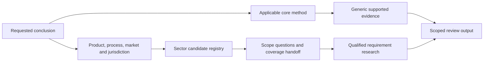

# Sector specialization framework

Status: **FRAMEWORK_READY**, AM-29, 2026-09-08. Audience: specialization authors, role-composition reviewers and integration evaluators.

AM-29 defines architecture and priorities for the 12 roadmap groups and preserves all 18 D-05 labels. **No sector requirement package is implemented.** The [registry](../../specializations/registry.json) is planning metadata; empty source lists and null implementation paths are deliberate coverage gaps.

## Components and flow

The core owns generic procedures and formulas. Role skillsets select core workflows. Canadian overlays own their scoped authority research. Future sector packages add evidenced requirement differences, with explicit product/process, market, legal, contractual and standard scope. None grants execution, certification or release authority.

[AM-28 composition](professional-skillset-contract.md) remains unchanged: a sector-dependent conclusion with missing coverage must be withheld while compatible generic work may continue. The new [coverage inspector](../../scripts/inspect-sector-coverage.py) reads planning metadata and emits context needs or coverage gaps. It never loads sector requirements or mutates the role resolver.

## Label reconciliation

- `automotive` (`sector`): Automotive product and supply-chain requirement research. No automatic coverage from transportation-equipment or customer naming.
- `aerospace` (`sector`): Aerospace product, process and supplier evidence research. No airworthiness, special-process or certification conclusion.
- `food-beverage` (`sector`): Food/beverage process and product-specific requirement research. No food-safety validation, label approval or product release.
- `medical-devices` (`sector`): Device-specific quality and manufacturing evidence research. No device classification, licensing, certification or release authority.
- `fabricated-metals` (`sector`): Fabricated-metal product and process requirement research. Does not imply welding qualifications or structural approval.
- `welding` (`process_overlay`): Joining-process evidence across product sectors. Not synonymous with fabricated metals; no welder or procedure certification.
- `machinery` (`sector`): Manufactured machinery product and change evidence research. No machine safety validation or operating permission.
- `electronics` (`sector`): Electronics assembly and product evidence research. Does not automatically cover electrical equipment or product certification.
- `plastics-rubber` (`sector`): Polymer/elastomer material and processing evidence research. Material and process subtypes remain distinct; no tooling or material-performance approval.
- `chemicals` (`sector`): Chemical-product and process requirement research. No pharmaceutical equivalence, hazard classification or chemical-use approval.
- `wood-paper` (`umbrella_alias`): Clarify wood-products and/or pulp-paper operation. Not an implemented common requirement set.
- `transportation-equipment` (`sector`): Broad transportation-equipment product requirement research. No automatic automotive or aerospace coverage; specific scope must be established.
- `pharmaceuticals` (`sector`): Retained pharmaceutical manufacturing requirement candidate. Not covered by medical-devices or chemicals; no pharmaceutical release.
- `electrical-equipment` (`sector`): Retained electrical-equipment product requirement candidate. Not equivalent to electronics; no product approval.
- `wood-products` (`sector`): Wood-product fabrication requirement candidate. Does not imply pulp-paper process requirements.
- `pulp-paper` (`sector`): Pulp/paper process requirement candidate. Does not imply wood-product fabrication coverage.
- `process-manufacturing` (`operating_mode`): Operating-mode classification across sectors. Not an industry-specific legal or regulatory overlay.
- `additive-manufacturing` (`process_overlay`): Cross-sector additive technology/process evidence research. Technology choice does not establish product conformity or sector coverage.

These dispositions implement [D-05](domain-contract.md#d-05-sector-specialization-and-role-composition). A broad transportation label cannot supply automotive/aerospace-specific requirements. Welding and additive technology compose with a product sector when relevant; they are not sector synonyms. Wood-paper requires clarification to wood-products and/or pulp-paper. Process-manufacturing is an operating mode and cannot select legal requirements.

## Sequencing priorities

These are internal authoring priorities based on existing core references and clarity of scope. No customer-demand evidence, legal urgency ranking, staffing, budget or delivery promise is assumed.

| Rank | Roadmap group | Phase | Rationale |
|---|---|---|---|
| 1 | `fabricated-metals` | STARTER_RESEARCH | Existing process-routing and quality packages offer a bounded first composition; welding remains a separate conditional question. |
| 2 | `machinery` | STARTER_RESEARCH | Existing change and machinery-review packages provide concrete evidence handoffs without design approval. |
| 3 | `plastics-rubber` | STARTER_RESEARCH | Parameter-control and substitution evidence provide a bounded core-to-sector test. |
| 4 | `electronics` | NEXT_RESEARCH | Existing BOM and process-change methods support focused assembly evidence; electrical-equipment scope needs separation. |
| 5 | `welding` | NEXT_RESEARCH | Cross-sector composition should be proven after one product-sector context; qualification evidence is an explicit gate. |
| 6 | `transportation-equipment` | NEXT_RESEARCH | Define broad scope before composing specific automotive or aerospace requirements. |
| 7 | `automotive` | SPECIALIST_RESEARCH | Customer/product scope and requirement provenance need a dedicated brief before authoring. |
| 8 | `aerospace` | SPECIALIST_RESEARCH | Product/program and review-authority evidence need a dedicated brief before authoring. |
| 9 | `food-beverage` | SPECIALIST_RESEARCH | Product/process scope and qualified source review must precede requirement authoring. |
| 10 | `medical-devices` | SPECIALIST_RESEARCH | Intended use, market and qualified scope research must precede requirement authoring. |
| 11 | `chemicals` | SPECIALIST_RESEARCH | Supplier/workplace/product roles and process limits require a separately scoped source review. |
| 12 | `wood-paper` | SCOPE_FIRST | Resolve the umbrella into wood-products and/or pulp-paper before selecting a requirements package. |

Retained candidates pharmaceuticals and electrical-equipment remain separate, without an assigned build commitment. Wood-products and pulp-paper inherit only the umbrella's scope-research priority, not each other's requirements. Additive-manufacturing remains a cross-sector research candidate. Revisit priorities when a concrete product use case, qualified reviewer and accessible source evidence exist.

## Future package contract

The registry defines required fields and promotion gates. A future package must contain scope and exclusions, market/jurisdiction, applicability basis, referenced atomic skills and roles, requirement differences, AM-07 source records, rights/access status, review owner, acceptance cases, observed evaluation and version history.

Each requirement difference needs a source key and locator, effective version, applicability basis, requested evidence, core handoff, reviewer and unresolved questions. Do not copy a core formula, duplicate an operating procedure, infer clauses from a standard title, or treat a customer reference as proof of legal incorporation.

Preserve legal instruments, official guidance, standards, contract terms and site facts separately. Use the [AM-07 schema](source-record-schema.json) and [freshness policy](source-freshness-policy.json). Capture publisher, identifier, title, URL, source class, scope, version, effectivity, access date, rights and claim-level support. No new legal or standards-version assertion is made in this wave, so no unverified source records are manufactured.

## State and output rules

- Generic-only request: GENERIC_METHOD_ONLY; sector conclusion remains unsupported.
- Missing label, umbrella or operating mode for a sector-dependent request: NEEDS_INPUT with scope questions.
- Known planned or unknown sector: COVERAGE_GAP with requested labels and a research handoff.
- Conflicting requirement evidence in later authoring: preserve both sources and block the dependent conclusion for qualified review.
- Structural readiness never promotes a planned sector into verified applicability.

A future implementation requires a new reviewed package and an explicit state/schema change; the inspector rejects unsupported promotion instead of inferring operational coverage. Supported outputs preserve generic evidence, unknown labels, context gaps, source/effectivity gaps and review owners. No live operation or professional conclusion follows from a resolved label.

## Decisions and tradeoffs

Use one metadata registry and reference core skills rather than create 12 placeholder SKILL.md files. This keeps planned coverage distinguishable from implemented skills but requires later explicit package promotion. Preserve the original labels instead of flattening them into 12 equivalent sectors; this adds scope questions but prevents unsupported equivalence. Keep sector inspection separate from the role resolver until actual requirement packages exist; AM-30 can test the handoff without implying installed sector coverage.

## Validation and open work

The AM-29 validator checks roadmap/D-05 coverage, unique priorities, canonical core/role references, planned-only state, required future fields, and coverage fixtures. Structural and Python results are not runtime model behavior, legal completeness or engineering adequacy.

Open work: select a concrete product/process and market for each future package, assign a qualified review owner, obtain current sources and authorized standards access, author only requirement differences, run behavioral evaluation, and complete applicable governance. AM-30 integration evaluation is next; AM-29 does not authorize building every specialization.
